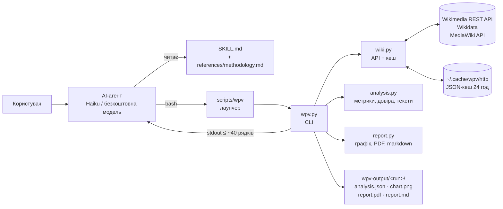
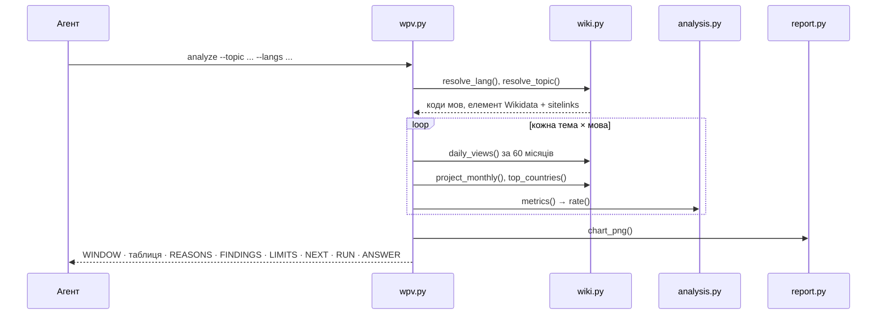

# Архітектура навички wikipedia-pageviews

Документ для розробників, які читатимуть або розвиватимуть навичку. Як користуватися
навичкою — у [README.md](../README.md), інструкції для агента — у [SKILL.md](../SKILL.md).

## Загальна схема

Агент читає `SKILL.md`, викликає CLI `scripts/wpv`, отримує короткий текстовий вивід і
файли в теці запуску. Уся робота з даними, статистика та оцінка довіри — у Python-коді,
а не в промпті.



## Файли

```
wikipedia-pageviews/
├── SKILL.md                 інструкції агенту (англійською, ~140 рядків)
├── README.md                для людей: встановлення, рішення, тестування, roadmap
├── requirements.txt         точні версії: matplotlib і його залежності
├── references/methodology.md   метрики й правила довіри (агент читає за потреби)
├── scripts/
│   ├── wpv                  bash-лаунчер: створює venv при першому запуску
│   ├── wpv.py               CLI: analyze | find | report, формат виводу
│   ├── wiki.py              HTTP, кеш, мови, теми, статті, перегляди
│   ├── analysis.py          метрики, рівень довіри, готові речення en/uk
│   └── report.py            графік, PDF на одну сторінку, markdown, claims-check
├── tests/test_analysis.py   13 офлайн-тестів (unittest) на синтетичних рядах
├── evals/                   сценарії, результати прогонів, OpenRouter-раннер
└── docs/                    архітектура, покращення, Q&A
```

Python-коду в `scripts/` приблизно 1 160 рядків. Стиль у всіх модулях однаковий: прості
функції над `dict`/`list`, без класів, короткий docstring у кожної функції, секції
`# --- ... ---`.

## Модулі

| Модуль | Відповідає за | Залежності |
|---|---|---|
| `scripts/wpv` | Перевіряє Python ≥ 3.11, створює `.venv` (або `~/.cache/wpv/venv`, якщо тека навички лише для читання), ставить закріплені пакети, запускає `wpv.py` | bash, python3 |
| `wpv.py` | Розбір аргументів, вікно дат, оркестрація запуску, формат stdout, коди виходу | `wiki`, `analysis`, `report` |
| `wiki.py` | HTTP з кешем і паузами, мови (sitematrix), теми (Wikidata), статті (MediaWiki), перегляди (REST) | лише stdlib |
| `analysis.py` | Помісячні суми, YoY, нормалізація, сплески, узгодженість, рівень довіри, тексти FINDINGS і LIMITS | лише stdlib |
| `report.py` | Графік (matplotlib), PDF як одна фігура A4, markdown, перевірка чисел у нотатках агента | matplotlib |

Модулі не мають спільного стану. Єдиний формат обміну між ними — `dict` результату, який
пишеться в `analysis.json`.

## Потік команди `analyze`



1. **Мови.** `resolve_lang` приймає код, назву мови чи типову помилку (`cz` → `cs`,
   `ua` → `uk`) і звіряє її зі списком відкритих Wikipedia з `sitematrix`.
2. **Тема.** `resolve_topic` приймає `Q123`, `lang:Title` або вільний текст. Для вільного
   тексту спершу пробує точну назву статті, потім пошук Wikidata; береться перший елемент,
   у якого є статті у Wikipedia.
3. **Статті.** Назва статті в кожній мові береться з sitelinks елемента Wikidata. Якщо
   статті немає, мова отримує статус `not_found` (прогалина в контенті). `--article`
   дозволяє задати статтю вручну; якщо її елемент Wikidata інший, вона позначається як
   замінник.
4. **Дані.** Щоденні перегляди людьми (`agent=user`, усі пристрої) за 60 повних місяців,
   дні без переглядів заповнюються нулями. Також тотал мовного розділу за місяцями і
   топ-країни його читачів.
5. **Метрики й довіра** рахуються в `analysis.py` (нижче).
6. **Вивід.** Результат пишеться в `analysis.json`, графік — у `chart.png`, у stdout
   друкується короткий підсумок.

Команда `report` читає `analysis.json` і `notes.md` агента, перевіряє числа в нотатках і
збирає `report.pdf` та `report.md`. Команда `find` шукає статті в одному мовному розділі і
показує їхні перегляди та елементи Wikidata.

## Режими порівняння

| Режим | Як задати | Що рахується |
|---|---|---|
| Одна тема, кілька мов | `--topic "Astronomy" --langs uk,pl` | Метрики по кожній мові, порівняння мов |
| Кошик статей | `--topic "English language;IELTS;TOEFL"` | Перегляди статей сумуються в кожній мові; показується покриття кошика |
| Кілька тем | `--topic "A" --topic "B" --langs ...` | Кожна тема окремо; висновки ранжують теми в кожній мові, PDF має окрему панель графіка на тему |

Обмеження розміру: до 8 мов (кількість кольорів палітри), до 4 тем і до 12 пар «тема ×
мова», щоб звіт уміщався на одну сторінку.

## Метрики й довіра

Деталі й пороги — у [references/methodology.md](../references/methodology.md).

- **YoY** — останні 12 повних місяців проти попередніх 12. Сезонність скорочується.
- **vs wiki** — зміна частки статті в переглядах усього мовного розділу. Прибирає загальне
  падіння або зростання трафіку Wikipedia.
- **per 1M** — переглядів на мільйон переглядів розділу. Рівень, який можна порівнювати
  між мовами різного розміру.
- **months** — скільки з 12 місяців були вищими (чи для спаду нижчими) за той самий місяць
  торік. Показує узгодженість тренду.
- **Зміна за вікно** — останні 12 місяців проти перших 12 вікна (при `--months` ≥ 36).

Довіра стартує з HIGH і обмежується правилами. Кожне обмеження додає причину, яку агент
цитує:

| Правило | Обмеження |
|---|---|
| Нова або перейменована стаття, менше 1 000 переглядів на місяць | LOW |
| Зміна тримається на сплесках; сирий і відносний тренд розходяться; менше 10 з 12 місяців у напрямку тренду; стаття-замінник; географія читачів схожа на ботів | MEDIUM |

Мови з ознаками ботів у реченні FINDINGS отримують пряме застереження й позначку `?`
у таблиці, і вони не потрапляють у рейтинг.

## Контракт виводу для агента

Вивід `analyze` — це інтерфейс між кодом і моделлю, тому він стабільний і короткий:

| Секція | Зміст |
|---|---|
| `WINDOW`, `TOPIC` | Вікно дат і знайдені елементи Wikidata з описом (щоб агент перевірив тему) |
| Таблиця | Мова, стаття, views/mo, YoY, vs wiki, per 1M, months, confidence |
| `REASONS` | Причини рівня довіри для кожного рядка |
| `FINDINGS` | Готові речення з числами — агент їх цитує, а не рахує сам |
| `LIMITS` | Готові застереження: гроші ≠ інтерес, мова ≠ ринок, кошик — припущення |
| `NEXT` | Точні команди для наступних кроків (замінник статті, PDF) |
| `RUN` | Абсолютний шлях до теки запуску |
| `ANSWER` | Останній рядок: формат відповіді та нагадування створити PDF, якщо його просили |

Помилки виводяться одним рядком `ERROR: ...` з підказкою, як виправити. Traceback
пишеться в `wpv-output/error.log`.

| Код виходу | Значення |
|---|---|
| 0 | Успіх |
| 1 | Неочікувана помилка (деталі в `error.log`) |
| 2 | Помилка вводу, яку може виправити агент (невідома мова, тема, тека запуску) |
| 3 | Мережа (можна повторити; кеш збережеться) |

## Дані запуску (`analysis.json`)

```text
topic, compare, topics[{qid, label, description}]
window{start, end, months}, generated, command
languages[]:
  lang, name, name_uk, topic, status (ok | not_found)
  articles[{title, qid, proxy, avg_monthly}], missing[], coverage
  months[], views[], project[], index[]
  avg_monthly, yoy, yoy_clean, norm_yoy, project_yoy, per_million, window_change
  months_up, months_down, sign_p, spike_days, spike_count, first_month
  trend, agree, confidence, reasons[{code, ...}], countries[[code, share]]
```

`analysis.json` — єдине джерело правди для звіту: `report` нічого не завантажує заново,
а claims-check звіряє числа саме з ним.

## Звіт

- PDF — одна фігура matplotlib розміром A4, тому він завжди рівно одна сторінка. Текст має
  ліміти рядків, а якщо все одно не вміщується, масштаб зменшується до 0.9 або 0.8.
- Блоки сторінки: заголовок, питання, висновки, графік, таблиця, рекомендація, наступні
  кроки (їх пише агент у `notes.md`), довіра й обмеження, джерело.
- Шрифт DejaVu Sans іде разом із matplotlib і покриває латиницю з діакритикою та кирилицю.
- Палітра — перевірена на розрізнення людьми з порушеннями кольоросприйняття, у
  фіксованому порядку; колір закріплений за мовою. Довіра — кольорова мітка плюс текст.
- Підписи — англійською або українською (`--lang`).

## Мережа, кеш, відтворюваність

- **Кеш:** кожна HTTP-відповідь зберігається як JSON-файл на 24 години. Уточнення («додай
  мову», «за 3 роки») майже не роблять нових запитів, бо історія завжди береться за 60
  місяців.
- **Ліміти:** запити послідовні, не частіше ніж раз на 0,25 с, повтори на 429/5xx з
  урахуванням `Retry-After`. Це відповідає robot policy Wikimedia для анонімних клієнтів.
- **User-Agent** з посиланням на репозиторій; перевизначається через `WPV_USER_AGENT`.
- **Залежності:** одна пряма (matplotlib), усі версії закріплені в `requirements.txt`,
  установка перевірена з нуля на Python 3.14; піни сумісні з 3.11–3.14.

## Тестування

- `tests/test_analysis.py` — 13 офлайн-тестів: кожне правило довіри на синтетичному ряді,
  тексти en/uk, режим порівняння тем, claims-check.
- `evals/` — сценарії, рубрика й результати прогонів на Claude Haiku 4.5 та безкоштовній
  моделі OpenRouter; `openrouter_agent.py` — мінімальний агент без залежностей.

## Точки розширення

| Що змінити | Де |
|---|---|
| Нове джерело даних (дампи, DuckDB) | `wiki.py`: функції `daily_views`, `project_monthly` повертають ті самі структури |
| Нове правило довіри | `analysis.rate()` + текст причини в `TEXT` + тест |
| Нова мова підписів звіту | `LABELS` у `report.py` і `TEXT` в `analysis.py` |
| Новий тип висновку | `analysis.findings()` / `compare_findings()` |
| Нова команда CLI | `wpv.py`: підкоманда в `main()` |
